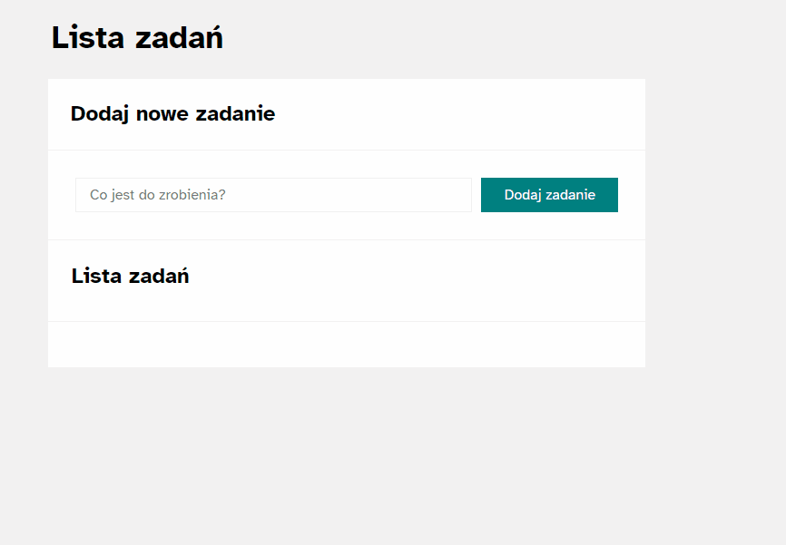

# Tasks creator - To-do list tool.
## How does it work?
You add a task to your task list. After completing an activity, you have the option to mark it as complete and hide all completed.

## DEMO:
https://ceteryzyna.github.io/tasks-creator/

## Preview: 

## Tech Stack:

- HTML
- Javascript
- CSS (media-queries, grid, flex)
- normalize.css
- BEM

